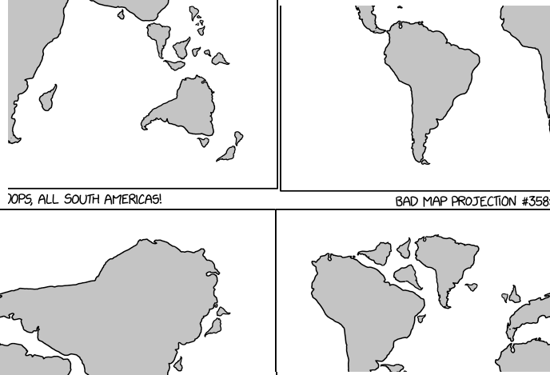
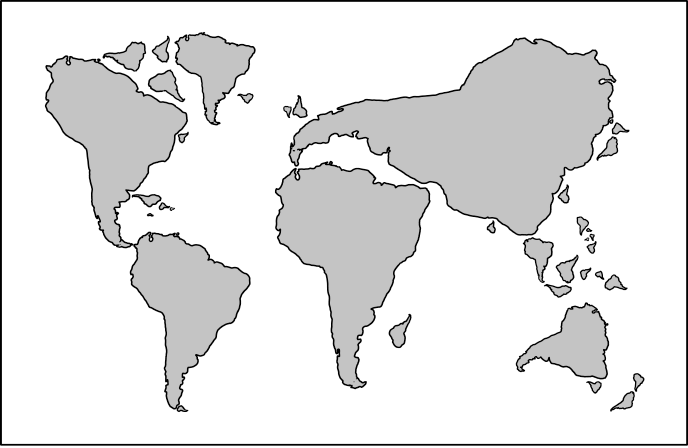

# Prova EcommIt + Java (Pleno)

Prova elaborada para programdores Java Pleno para vaga de desenvolvedor

## Versão
* 1.0

## Prova

Esta prova tem como objetivo atestar os conhecimentos do candidato em Java Backend.

* O tempo da prova é 5 dias para analista pleno.
* É permitido utilizar outras frameworks e libraries (desde que se mantenha em Java).
* Realize um fork do projeto e ao completar mande uma pull request e nos mande um e-mail contato@ecommit.com.br (Tutorial de como fazer isso : http://pythonclub.com.br/como-fazer-fork-clone-push-pull-request-no-github.html)

### O que ganha pontos 
* Organização do código.
* Clareza no código.
* Resolver o que foi proposto.
* Testes unitários (se julgar necessário).
* Prazo proposto.
* Organizacao no projeto

### O que perde pontos
* Copiar inteiro do amigo.
* Pedir para outra pessoa fazer por você.
* Códigos lentos.
* Códigos mal escritos ou incompreensiveis.
* Variaveis muito longas ou sem sentido.

### Dúvidas
* Abra uma issue ou entre em contato conosco contato@ecommit.com.br

### A prova

#### Para analistas Junior, as tarefas são as seguintes:
* Ler dados da API externa
    - [ ] Serialize o JSON dinamicamente para um objeto (https://xkcd.com/info.0.json).
    - [ ] Leia a imagem do objeto img do JSON na memoria
    - [ ] Crie um algoritimo que consiga dividir a imagem em 4 e embaralhar a imagem.

    * Imagem Original 
    

    

    * Imagem Embaralhada

    

    - [ ] A cada execucao do programa salve a imagem embaralhada com Crypt_AnoMesDia.png (Ano Mes Dia deve ser substituido pelo dado real).
    - [ ] Escreva o log no Console com o que esta ocorrendo.
    - [ ] *Bonus : Crie um banco de dados utilizando ou JPA ou Hibernate e salve o JSON recebido no banco a cada execucao.
    - [ ] *Desafio : Remova o texto do fim da imagem e salve no arquivo Clean_AnoMesDia.png

    * Imagem Original 

    
!

* Crie um projeto Maven
    - [ ] Utilize o SpringBoot Console Application
    - [ ] Utilize o Logback para realizar os logs do que esta ocorrendo
    

### Pré-requisitos

* Internet
* Maven
* Java
* Logback
* Spring (https://start.spring.io/)

## Autores

* **Carlos Augusto** - *Dev* - [engaugusto](https://github.com/engaugusto)

## Licença

A licença do projeto escolhida foi a MIT [LICENSE](LICENSE) para mais detalhes.
